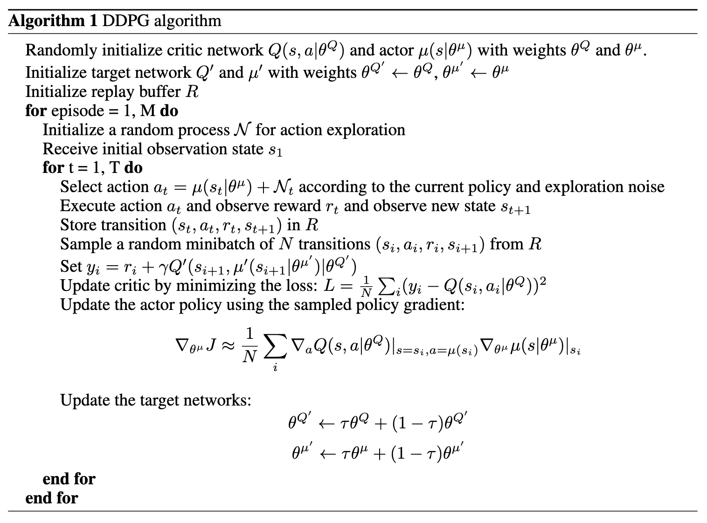
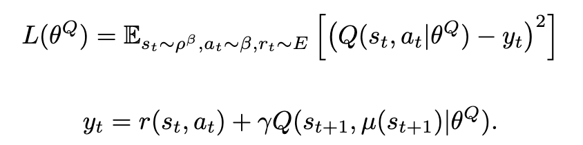
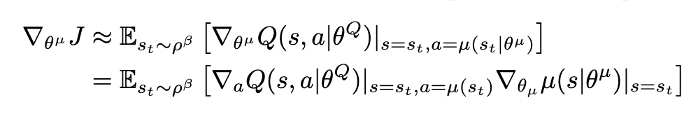

# Deep Deterministic Policy Gradient (DDPG)

PyTorch reimplementation of the paper ["Continuous control with deep reinforcement learning"](https://arxiv.org/abs/1509.02971) from Lillicrap et al., 2016.

|                                                  |
| ------------------------------------------------ |
|  |
| *Deep Deterministic Policy Gradient Algorithm. Taken from [Lillicrap et al., 2016](https://arxiv.org/abs/1509.02971).*| 

|                                                    |                                                  |
| -------------------------------------------------- | ------------------------------------------------ |
|  |  |
| *Objective function used to train the critic. Taken from [Lillicrap et al., 2016](https://arxiv.org/abs/1509.02971).*     | *Policy gradient. Taken from [Lillicrap et al., 2016](https://arxiv.org/abs/1509.02971).* |

## Usage

```python
import gymnasium as gym
from ddpg import DDPG, ActorMLP, CriticMLP


env = gym.make("Hopper-v5")
actor = ActorMLP(state_dim=11, h1_dim=400, h2_dim=300, action_dim=3)
critic = CriticMLP(state_dim=11, h1_dim=400, h2_dim=300, action_dim=3)

ddpg = DDPG(
    actor, 
    critic,
    timesteps=3_000_000,
    lr_actor=1e-4,
    lr_critic=1e-3,
    critic_weight_decay=1e-2,
    gamma=0.99,
    tau=1e-3
)

ddpg.train(env)
```

## Experimental setup

* OS: Fedora Linux 42 (Workstation Edition) x86_64
* CPU: AMD Ryzen 5 2600X (12) @ 3.60 GHz
* GPU: NVIDIA GeForce RTX 3060 ti (8GB VRAM)
* RAM: 32 GB DDR4 3200 MHz

## Citations

```bibtex
@misc{lillicrap2019continuouscontroldeepreinforcement,
      title={Continuous control with deep reinforcement learning}, 
      author={Timothy P. Lillicrap and Jonathan J. Hunt and Alexander Pritzel and Nicolas Heess and Tom Erez and Yuval Tassa and David Silver and Daan Wierstra},
      year={2019},
      eprint={1509.02971},
      archivePrefix={arXiv},
      primaryClass={cs.LG},
      url={https://arxiv.org/abs/1509.02971}, 
}
```